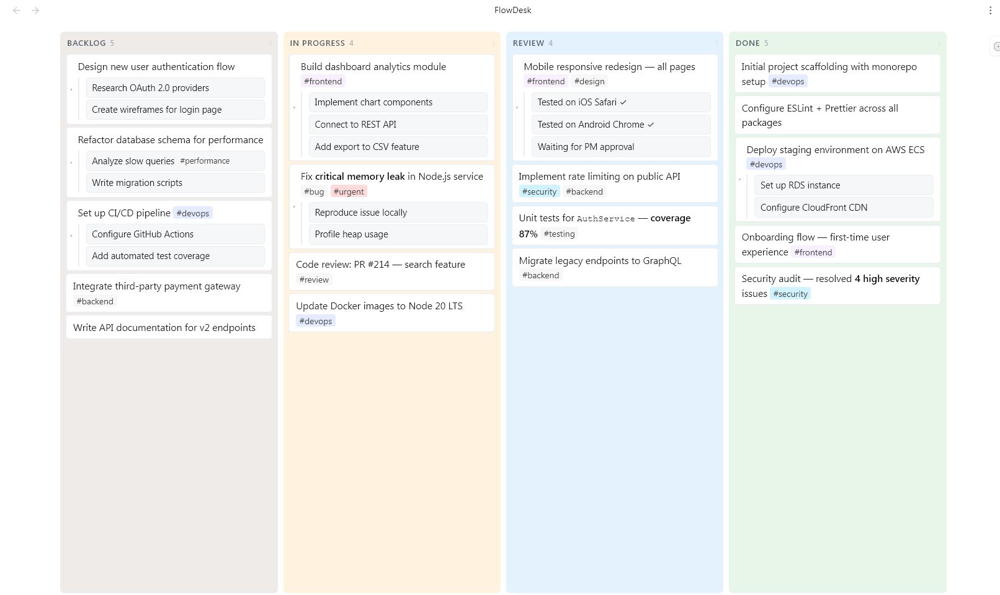
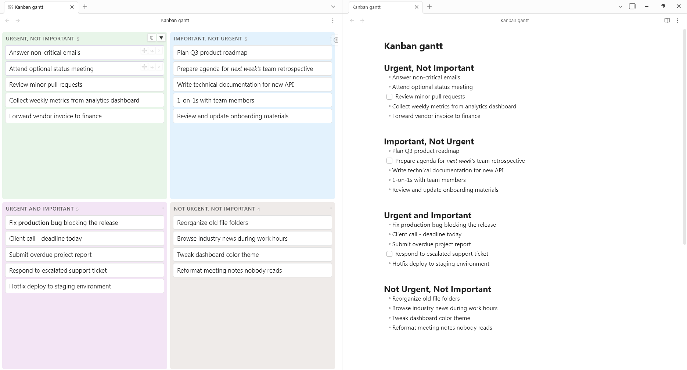
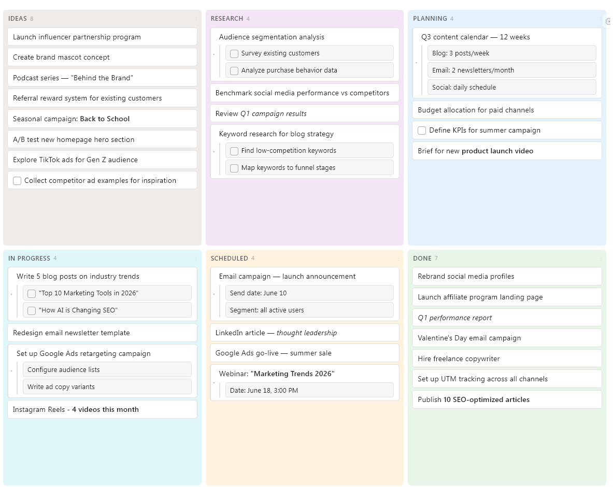
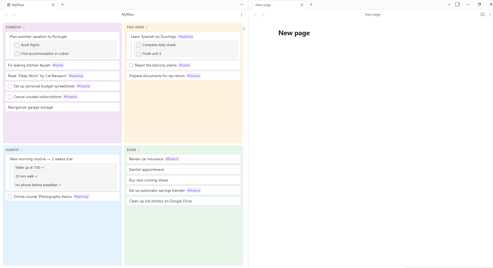
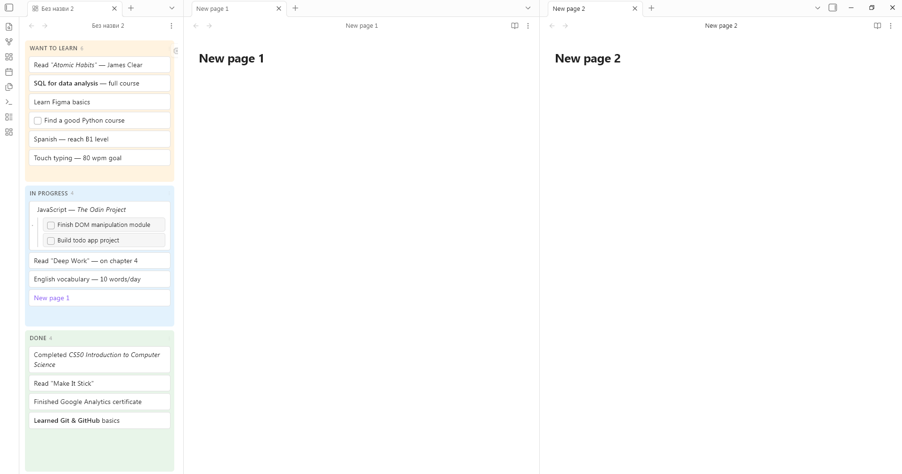

# Simple Kanban

**Simple Kanban** is a lightweight Obsidian plugin that turns any note into a visual Kanban board — instantly, without leaving your vault.







---

## ✨ Features

- **Any note becomes a Kanban board** — open any existing note as a board with a single command
- **Tasks & subtasks** — nest tasks by indenting list items
- **Drag & drop** — reorder cards and columns freely; drag a card onto another to make it a subtask
- **Flexible layouts** — arrange columns as a vertical list, 2×2 grid, or any custom layout that fits your screen
- **Hashtag colors** — add `#tags` to cards and assign custom colors per tag in plugin settings
- **Column colors** — set individual background colors for each column
- **Hide columns** — collapse columns you don't need right now
- **Checkbox support** — native Obsidian checkboxes work inside cards; toggle visibility as needed
- **Custom checkbox themes** — supports emoji checkboxes from your Obsidian theme
- **Double-click to add** — quickly add a new card by double-clicking anywhere in a column
- **Undo on delete** — accidentally deleted a card? Undo brings it right back

---

## 🚀 How to use

### Open any note as a Kanban board

1. Open the note you want to turn into a board
2. Press `Ctrl+P` to open the Command Palette
3. Run: **Simple Kanban: Open current note as Kanban board**

Or click the **Simple Kanban icon** in the left sidebar ribbon.

---

## 📝 Note format

Simple Kanban reads standard Markdown. Each `##` heading becomes a column, and list items become cards:

```markdown
## To Do
- Task one
- Task two
  - Subtask A
  - Subtask B
- [ ] Task with checkbox

## In Progress
- Another task #urgent

## Done
- Completed task
```

---

## 💡 Use cases

**Project management** — track Backlog, In Progress, Review, and Done across your team or personal projects.

**Eisenhower Matrix** — organize tasks by urgency and importance using a 2×2 grid layout.

**Weekly planning** — create a board with columns like Someday, This Week, Almost, and Done to manage your personal workflow.

**Content pipeline** — plan and track blog posts, videos, or social content from Ideas to Published.

**Learning tracker** — organize courses, books, and skills you want to learn, are learning, and have completed.

---

## ⚙️ Settings

| Setting | Description |
|---|---|
| Tag colors | Assign a color to any `#hashtag` |
| Column colors | Set a background color per column |
| Checkbox visibility | Show or hide checkboxes on cards |
| Layout | Choose between list, grid, or custom column layout |

---

## 📦 Installation

1. Open Obsidian → **Settings → Community plugins**
2. Disable Safe Mode if needed
3. Click **Browse** and search for **Simple Kanban**
4. Click **Install**, then **Enable**

---

## 🤝 Contributing

Pull requests and issues are welcome! Feel free to open an issue for bugs or feature requests.

---

## 📄 License

[MIT](LICENSE)
